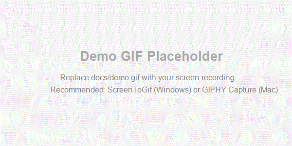

# Chrome Timer — 网页定时任务管理器

[](https://github.com/leeuoy/chrome_timer_auto_click_helper)
[](https://developer.chrome.com/docs/extensions/mv3/intro/)
[](LICENSE)
[](README.md)

一个强大的 Chrome 扩展，可以在网页上创建定时任务，自动点击元素或执行自定义 JavaScript 脚本。

**[English README](README.md)**

---

<div align="center">
  
  <p><em>快速演示：创建任务 → 点击🌐切换语言 → 在5种语言间切换 → 界面即时更新</em></p>
</div>

---

## 功能特性

- **元素选择器** — 通过可视化拾取模式，一键选中页面元素并生成 CSS 选择器
- **Cron 调度** — 支持 6 字段 Cron 表达式（秒 分 时 日 月 星期），灵活配置执行频率
- **JS 脚本编辑** — 内置代码编辑器，可编写任意 JavaScript 脚本在页面上下文中执行
- **按域名管理** — 任务按网站域名分组，互不干扰
- **动态时钟图标** — 扩展图标实时显示当前时间
- **精简/完整选择器** — 可切换选择器生成模式，适配不同场景
- **I18n 国际化** — 支持 5 种语言（简体中文、English、日本語、한국어、繁體中文），下拉切换，语言偏好自动保存

## 使用场景

- 定时自动点击按钮（如自动签到、自动刷新页面）
- 按 Cron 计划运行自定义 JS 脚本（如数据抓取、表单填写）
- 替代简单的 Tampermonkey 脚本，无需编码或低代码即可操作
- 自动化重复性网页操作，无需开发完整扩展

## 安装

1. 克隆或下载本仓库到本地
2. 打开 Chrome，访问 `chrome://extensions/`
3. 开启右上角 **开发者模式**
4. 点击 **加载已解压的扩展程序**，选择本项目根目录
5. 扩展图标出现在工具栏，即可使用

## 使用方法

### 创建定时任务

1. 点击扩展图标打开弹出面板
2. 面板顶部显示当前页面域名
3. 点击 **添加任务** 创建新任务
4. 配置 Cron 表达式（默认每 3 秒执行一次）
5. 编写或修改执行脚本

### 选择页面元素

1. 点击 **选择元素** 按钮
2. 鼠标移到目标元素上，元素高亮显示
3. 点击元素，选择器自动填入脚本
4. 按 `Esc` 可取消选择

### 切换语言

1. 点击弹出面板头部的 🌐 地球图标
2. 从下拉菜单中选择你偏好的语言
3. 所有界面文本即时更新，语言选择自动保存
4. 下次打开弹出面板时，将使用你保存的语言
5. 若未保存过语言，扩展会自动检测浏览器语言

### 执行脚本

默认脚本模板：

```javascript
const el = document.querySelector("{{SELECTOR}}");
if (el) el.click();
```

`{{SELECTOR}}` 会在元素选择后自动替换为实际的 CSS 选择器。你也可以编写任意自定义脚本。

## 项目结构

```
chrome_timer_click_helper/
├── manifest.json        # 扩展清单文件（Manifest V3）
├── background.js        # Background Service Worker（时钟图标等）
├── content.js           # Content Script（元素选择、任务执行）
├── editor-module.js     # 内置代码编辑器模块
├── i18n.js              # 国际化模块（5 种语言）
├── popup.html           # 弹出面板页面
├── popup.css            # 弹出面板样式
├── popup.js             # 弹出面板逻辑
├── icons/               # 扩展图标
│   ├── icon16.png
│   ├── icon48.png
│   └── icon128.png
└── docs/                # 文档与图片资源
    ├── demo.gif         # 演示录屏
    ├── alipay.jpg       # 支付宝收款码
    └── wechat.jpg       # 微信收款码
```

## 技术栈

- Chrome Extension Manifest V3
- Vanilla JavaScript（无框架依赖）
- chrome.storage.local 持久化存储
- CSS 选择器 + DOM 操作
- I18n 国际化，支持自动检测浏览器语言并持久化保存语言偏好

## 参与贡献

欢迎贡献！请参阅 [CONTRIBUTING.md](CONTRIBUTING.md) 了解参与指南。

## 赞助支持

如果这个项目对你有帮助，欢迎请我喝杯咖啡 ☕

<div align="center">

| 支付宝 | 微信 |
|:---:|:---:|
|  |  |

</div>

## 许可证

[MIT](LICENSE)